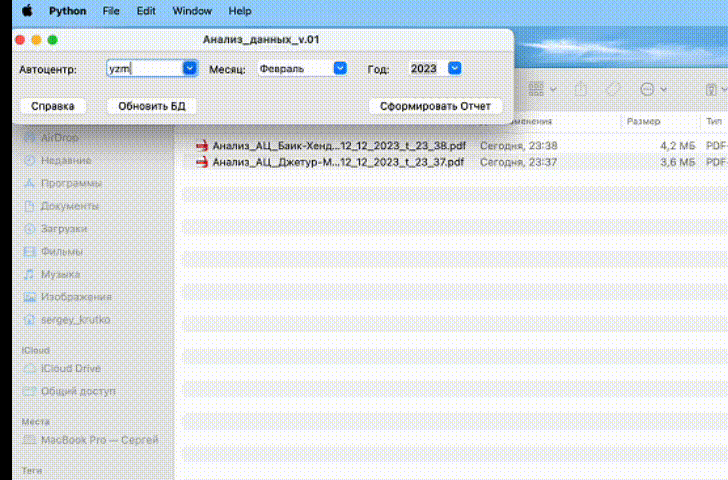

# Анализ деятельности АЦ за период
### Описание проекта
Производит анализ деятельности предприятия за период, 
в том числе накопительно с начала года и динамикой некоторых показателей за два года.  
У пользователя есть возможность выбора: подразделения, месяца и года, возможность 
обновления БД (сбор скриптами `python`).   
Отчет сохраняется в PDF файл, в названии имеет наименование подразделения, 
период анализа и дату формирования отчета.  
Имеется прогрессбар для визуальной ориентации процесса
выполнения.  
Проект собирается в исполняемый файл через `auto-py-to-exe` для удобства пользователя

### Панель управления

   

[ОБРАЗЕЦ_ОТЧЕТА](https://drive.google.com/file/d/10LBAkqqwQCXrIS5RM9LhpUSEJNriEPT-/view?usp=sharing)

### Технологии
````
Python 3.11.4  

pandas, matplotlib, seaborn, 
numpy, fpdf, dataframe_image, 
df2img, pyxlsb, openpyxl,
auto-py-to-exe
````
##### _Запуск проекта в dev-режиме_
- установите и активируйте виртуальное окружение (выполните команды):  
```
python3 -m venv venv  
```  
```
source venv/bin/activate  
```  
- Установите зависимости из файла requirements.txt  
```
pip install -r requirements.txt  
```  

### Авторы
Сергей К [ссылка на telegram](https://t.me/magnus_red) 


